# Gestor de BD - API Backend

API RESTful construida con .NET 9 y ASP.NET Core, diseñada siguiendo los principios de Arquitectura Limpia. Su propósito es la gestión de usuarios y la provisión de instancias de bases de datos MySQL en contenedores Docker aislados, con autenticación JWT y autorización basada en roles.

## Características Principales

-   **Provisión de Instancias MySQL con Docker**: Creación, gestión y aislamiento de bases de datos MySQL en contenedores Docker individuales.
-   **Aislamiento en Entornos Compartidos**: Uso de nombres de contenedor únicos, etiquetas Docker y límites de recursos (CPU/RAM) para garantizar una operación segura en entornos multi-inquilino como la UPS.
-   **Persistencia de Datos con Volúmenes Docker**: Los datos de las instancias se almacenan en volúmenes persistentes en el host, asegurando que no se pierdan al reiniciar contenedores.
-   **Autenticación Segura con JWT**: Implementación de Access Tokens y Refresh Tokens.
-   **Autorización Basada en Roles**: Endpoints protegidos que requieren roles específicos ("Admin" o "User").
-   **Arquitectura Limpia**: Separación estricta de responsabilidades entre las capas de Dominio, Aplicación, Infraestructura y API.
-   **Entity Framework Core 9**: Interacción con la base de datos de metadatos (MySQL) a través del proveedor Pomelo.
-   **Documentación de API con Swagger**: Interfaz de usuario interactiva para probar los endpoints.

## Cómo Empezar

Esta guía es para configurar el proyecto por primera vez en un entorno de desarrollo local, conectándose a la base de datos compartida en Aiven.

### Prerrequisitos

-   **[.NET 9 SDK](https://dotnet.microsoft.com/download/dotnet/9.0)**
-   **Docker Desktop**: Debe estar instalado y **en ejecución** en tu máquina.
-   **Un cliente MySQL (Opcional pero recomendado)**: DBeaver, DataGrip, o el CLI de `mysql` para verificar la conexión.

### 1. Configuración del Proyecto

-   Clona este repositorio.
-   Abre el archivo `nexusDB.Api/appsettings.json` y verifica que la cadena de conexión `DefaultConnection` apunte a la base de datos compartida en Aiven. **No compartas esta información sensible en commits públicos.**

### 2. Sincronización de la Base de Datos (Método Seguro)

Esta sección explica cómo asegurar que tu base de datos local esté sincronizada sin afectar la base de datos compartida.

**Paso 2.1: Verificar Conexión a Aiven (Opcional)**

Puedes probar tu conexión a la base de datos compartida usando el siguiente comando en una terminal (CMD o PowerShell). Se te pedirá la contraseña de forma interactiva y segura.

```sh
mysql --user avnadmin -p --host elconectorhost.example.com --port tupuerto --database elnombre
```

**Paso 2.2: Instalar Herramientas de EF Core**

Este proyecto utiliza una versión local de las herramientas de Entity Framework Core para evitar conflictos. Ejecuta estos comandos **una sola vez** en la raíz del proyecto:

1.  **Crear el manifiesto de herramientas:**
    ```sh
    dotnet new tool-manifest
    ```
2.  **Instalar la versión correcta de `dotnet-ef`:**
    ```sh
    dotnet tool install dotnet-ef --version 9.0.0
    ```

**Paso 2.3: Aplicar Migraciones Pendientes (Comando Seguro)**

El siguiente comando **NO es destructivo**. Compara el estado de la base de datos en Aiven con el código y solo aplica las migraciones que falten. Es seguro ejecutarlo incluso si la base de datos ya está actualizada.

```sh
dotnet ef database update --project nexusDB.Infrastructure --startup-project nexusDB.Api
```

### 3. Ejecutar la Aplicación

1.  **Asegúrate de que Docker Desktop esté en ejecución.** Este es un requisito indispensable para que la API pueda crear los contenedores de las instancias.
2.  Ejecuta la aplicación desde tu IDE o con el siguiente comando en la terminal:
    ```sh
    dotnet run --project nexusDB.Api
    ```

La API estará disponible en `https://localhost:XXXX`. La documentación de Swagger estará en `https://localhost:XXXX/swagger`.

---

## Endpoints de la API

### Autenticación (`/api/Auth`)

-   `POST /register`: Registra un nuevo usuario.
-   `POST /login`: Inicia sesión y obtiene tokens JWT.
-   `POST /refresh`: Refresca el Access Token.
-   `POST /logout`: Invalida el Refresh Token.

### Gestión de Instancias (`/api/instances`)

Endpoints para la creación y gestión de instancias MySQL en contenedores Docker, con control de acceso por roles.

#### **Endpoints para Administradores (`[Authorize(Roles = "Admin")]`)**

-   **`POST /api/instances`**
    -   **Descripción**: Crea una nueva instancia MySQL en un contenedor Docker y la asigna a un usuario.
    -   **Consumo (Body JSON)**:
        ```json
        {
          "engine": "mysql",
          "name": "db_para_estudiante",
          "username": "user_estudiante",
          "userPassword": "password_seguro_123",
          "ownerUserId": 2 
        }
        ```
    -   **Respuesta Exitosa**: `201 Created`.

-   **`GET /api/instances`**
    -   **Descripción**: Obtiene una lista de todas las instancias registradas.
    -   **Respuesta Exitosa**: `200 OK` con un array de objetos `Instance`.

-   **`GET /api/instances/user/{userId}`**
    -   **Descripción**: Obtiene los detalles de la instancia asignada a un usuario específico.
    -   **Respuesta Exitosa**: `200 OK` con el objeto `Instance`.

#### **Endpoints para Usuarios (`[Authorize(Roles = "User")]`)**

-   **`GET /api/instances/my-instance`**
    -   **Descripción**: Obtiene los detalles de la instancia asignada al usuario autenticado.
    -   **Respuesta Exitosa**: `200 OK` con el objeto `Instance`.
    -   **Respuesta si no existe**: `404 Not Found`.

-   **`POST /api/instances/query`**
    -   **Descripción**: Ejecuta una consulta SQL en la instancia asignada al usuario.
    -   **Consumo (Body JSON)**:
        ```json
        {
          "query": "SELECT * FROM mi_tabla;"
        }
        ```
    -   **Respuesta Exitosa**: `200 OK` con el resultado de la consulta.

### Diagrama de Casos de Uso (PlantUML)

```plantuml
@startuml
!define RECTANGLE class
skinparam packageStyle rectangle
skinparam actorStyle awesome

skinparam usecase {
  BackgroundColor #0EA5E9          <<Admin>>
  BorderColor     #0369A1          <<Admin>>
  BackgroundColor #10B981          <<Student>>
  BorderColor     #047857          <<Student>>
}

actor Administrador
actor Estudiante

rectangle "Sistema GestorBD" {
  usecase "UC-01\nIniciar sesión" as UC01

  usecase "UC-02a\nCrear instancia BD" as UC02a <<Admin>>
  usecase "UC-02b\nIniciar/detener motor" as UC02b <<Admin>>
  usecase "UC-02c\nEliminar instancia" as UC02c <<Admin>>
  usecase "UC-02d\nListar todas las instancias" as UC02d <<Admin>>
  usecase "UC-02e\nVer instancia de usuario" as UC02e <<Admin>>

  usecase "UC-03\nAsignar instancia" as UC03 <<Admin>>
  usecase "UC-04\nMonitorear logs" as UC04 <<Admin>>
  usecase "UC-09\nReiniciar motor" as UC09 <<Admin>>

  usecase "UC-05\nVer mi instancia" as UC05 <<Student>>
  usecase "UC-06\nEjecutar consultas" as UC06 <<Student>>
  usecase "UC-07\nCRUD visual" as UC07 <<Student>>
  usecase "UC-08\nExportar datos" as UC08 <<Student>>

  ' Servicios internos (sin actor stick)
  usecase "Validar Docker" as UC10
  usecase "Notificar asignación" as UC11
}

' --------- Relaciones actor → UC ---------
Administrador --> UC01
Estudiante    --> UC01

Administrador --> UC02a
Administrador --> UC02b
Administrador --> UC02c
Administrador --> UC02d
Administrador --> UC02e
Administrador --> UC03
Administrador --> UC04
Administrador --> UC09

Estudiante --> UC05
Estudiante --> UC06
Estudiante --> UC07
Estudiante --> UC08

' --------- Includes (obligatorios) ---------
UC02a ..> UC10 : <<include>>
UC02b ..> UC10 : <<include>>
UC02c ..> UC10 : <<include>>
UC03  ..> UC11 : <<include>>
UC09  ..> UC10 : <<include>>

' --------- Extend (opcional) ---------
UC06 ..> UC07 : <<extend>>
@enduml
```



| UC-ID  | Nombre (en el diagrama) | Actor      | ¿Qué hace?                               | Criterio rápido                               |
| ------ | ----------------------- | ---------- | ---------------------------------------- | --------------------------------------------- |
| UC-01  | Iniciar sesión          | Ambos      | Login JWT                                | Token ≤ 15 min                                |
| UC-02a | Crear instancia BD      | Admin      | Crea motor MySQL en Docker               | Puerto dinámico, límites CPU/RAM, volumen persistente |
| UC-02b | Iniciar/detener motor   | Admin      | Start/stop contenedor Docker             | Docker running/stopped ≤ 30 s                 |
| UC-02c | Eliminar instancia      | Admin      | Borra contenedor Docker y registro en DB | Sin errores, log audit                        |
| UC-02d | Listar todas las instancias | Admin  | Obtiene todas las instancias registradas | Muestra todas las instancias                  |
| UC-02e | Ver instancia de usuario | Admin     | Obtiene instancia de un usuario específico | Muestra instancia o 404                       |
| UC-03  | Asignar instancia       | Admin      | Entrega BD a alumno (parte de UC-02a)    | Solo sus instancias                           |
| UC-04  | Monitorear logs         | Admin      | Ver logs/métricas (futuro)               | Delay < 5 s                                   |
| UC-09  | Reiniciar motor         | Admin      | Recupera falla (futuro)                  | Reinicio < 30 s                               |
| UC-05  | Ver mi instancia        | Estudiante | Ve datos de conexión de su instancia     | Carga ≤ 3 s                                   |
| UC-06  | Ejecutar consultas      | Estudiante | Query SQL/NoSQL en su instancia          | Resultados < 30 s                             |
| UC-07  | CRUD visual             | Estudiante | Edición gráfica (futuro)                 | Extend opcional                               |
| UC-08  | Exportar datos          | Estudiante | Descarga CSV/JSON (futuro)               | Archivo ≤ 50 MB, < 10 s                       |