# Gestor de BD - API Backend

API RESTful construida con .NET 9 y ASP.NET Core, diseñada siguiendo los principios de Arquitectura Limpia (Clean Architecture). Proporciona una base sólida y segura para la gestión de usuarios y la provisión de instancias de bases de datos MySQL en contenedores Docker, con autenticación JWT y autorización basada en roles.

## Características Principales

-   **Provisión de Instancias MySQL con Docker**: Creación, gestión y aislamiento de bases de datos MySQL en contenedores Docker individuales para cada usuario.
-   **Aislamiento Robusto en Entornos Compartidos**: Uso de nombres de contenedor únicos, etiquetas Docker (labels) y límites de recursos (CPU/RAM) para garantizar la coexistencia pacífica en entornos como la UPS.
-   **Persistencia de Datos con Volúmenes Docker**: Los datos de las instancias MySQL se almacenan en volúmenes persistentes en el host, asegurando que no se pierdan al reiniciar o eliminar contenedores.
-   **Autenticación Segura con JWT**: Implementación completa de Access Tokens y Refresh Tokens.
-   **Logout del Lado del Servidor**: Invalidación de Refresh Tokens para un cierre de sesión seguro.
-   **Autorización Basada en Roles**: Endpoints protegidos que requieren roles específicos ("Admin" o "User") para controlar el acceso a la gestión y uso de instancias.
-   **Arquitectura Limpia**: Separación estricta de responsabilidades entre las capas de Dominio, Aplicación, Infraestructura y API.
-   **Domain-Driven Design (DDD)**: Uso de Value Objects (`Email`, `Password`, `PersonName`) para encapsular la lógica de negocio y asegurar la validez de los datos en el núcleo del dominio.
-   **Hashing de Contraseñas y Refresh Tokens**: Uso de `BCrypt.Net` para almacenar credenciales y tokens de forma segura.
-   **Manejo de Resultados Explícito**: Implementación de objetos `Result` para un manejo de errores y éxitos claro y tipado.
-   **Respuestas de Error Estandarizadas**: Uso de `ProblemDetails` para devolver errores consistentes según las guías de Microsoft.
-   **Entity Framework Core 9**: Interacción con la base de datos MySQL a través del proveedor Pomelo.
-   **Documentación de API con Swagger**: Interfaz de usuario interactiva para probar los endpoints de la API, configurada para manejar la autenticación JWT.

## Arquitectura del Proyecto

El proyecto sigue una estricta estructura de Arquitectura Limpia, donde las dependencias fluyen hacia el centro (Dominio).

```
Api/ → Application/ → Domain ←
Infrastructure/ → Application/ → Domain ←
```

-   **`Domain`**: Contiene las entidades puras del negocio (`User`, `Role`, `Instance`) y los Value Objects. Es el núcleo y no depende de ninguna otra capa.
-   **`Application`**: Contiene la lógica de la aplicación, definiendo los "casos de uso" a través de interfaces (`IAuthService`, `IInstanceService`) y los DTOs que sirven como contratos de datos.
-   **`Infrastructure`**: Implementa las interfaces de la capa de Aplicación. Contiene la lógica de acceso a la base de datos (`AppDbContext`), la implementación de servicios externos (`JwtService`, `AuthService`), el servicio de cifrado (`AesEncryptionService`) y la **interacción con Docker para la gestión de instancias MySQL (`MySqlProvider`)**.
-   **`Api`**: Es el punto de entrada de la aplicación. Contiene los Controladores, la configuración del middleware y el arranque de la aplicación (`Program.cs`).

## Cómo Empezar

Sigue estos pasos para levantar el entorno de desarrollo local.

### Prerrequisitos

-   [.NET 9 SDK](https://dotnet.microsoft.com/download/dotnet/9.0)
-   **Docker Desktop en ejecución**: Es fundamental para la provisión de instancias MySQL.
-   Una instancia de base de datos MySQL en Aiven (o local) para la base de datos principal de la aplicación (`nexusDB`).

### 1. Configuración del Proyecto

-   Clona este repositorio.
-   Abre el archivo `nexusDB.Api/appsettings.Development.json`.
-   Modifica la cadena de conexión `DefaultConnection` para que apunte a tu base de datos MySQL principal (Aiven o local).

    ```json
    "ConnectionStrings": {
      "DefaultConnection": "Server=your_server;Database=nexusDB;Port=your_port;User=your_user;Password=your_password;"
    }
    ```
    Asegúrate de que el usuario de la base de datos tenga permisos para crear y eliminar bases de datos.

### 2. Configuración de la Base de Datos Principal (Aiven/Local)

Usa Entity Framework Core para crear y sembrar la base de datos y las tablas a partir de las entidades del proyecto.

Abre una terminal en la raíz del proyecto (`C:/Users/Msuthy/Desktop/gestorBD_Backend/`) y ejecuta los siguientes comandos:

1.  **Instalar `dotnet-ef` como herramienta local:**
    ```sh
    dotnet new tool-manifest
    dotnet tool install dotnet-ef --version 9.0.0
    ```

2.  **Eliminar la base de datos existente (si hay alguna):**
    ```sh
    dotnet ef database drop --project nexusDB.Infrastructure --startup-project nexusDB.Api
    ```
    Confirma con `y` cuando se te solicite.

3.  **Crear una nueva migración inicial:**
    ```sh
    dotnet ef migrations add InitialCreate --project nexusDB.Infrastructure --startup-project nexusDB.Api
    ```
    Este comando creará una migración que incluye la creación de tablas y el seeding de los roles "User" y "Admin".

4.  **Aplicar la migración a la base de datos:**
    ```sh
    dotnet ef database update --project nexusDB.Infrastructure --startup-project nexusDB.Api
    ```
    Esto creará la base de datos y las tablas, e insertará los roles iniciales.

### 3. Ejecutar la Aplicación

```sh
dotnet run --project nexusDB.Api
```

La API estará disponible en `https://localhost:XXXX` (la URL se mostrará en la consola). La documentación de Swagger estará disponible en `https://localhost:XXXX/swagger`.

## Endpoints de la API

### Autenticación y Usuarios (`/api/Auth`)

(Esta sección no requiere cambios, ya que la funcionalidad de los endpoints es la misma)

-   `POST /api/Auth/register`: Registra un nuevo usuario.
-   `POST /api/Auth/login`: Inicia sesión y obtiene tokens JWT.
-   `POST /api/Auth/refresh`: Refresca el Access Token usando el Refresh Token.
-   `POST /api/Auth/logout`: Invalida el Refresh Token para cerrar sesión de forma segura.

### Gestión de Instancias de Bases de Datos (`/api/instances`)

Estos endpoints permiten la creación y gestión de instancias MySQL en contenedores Docker, con control de acceso basado en roles.

#### **Endpoints para Administradores (`[Authorize(Roles = "Admin")]`)**

-   **`POST /api/instances`**
    -   **Descripción**: Crea una nueva instancia de base de datos MySQL en un contenedor Docker y la asigna a un usuario.
    -   **Consumo**:
        ```json
        {
          "engine": "mysql",
          "name": "NombreDeLaBaseDeDatos",
          "username": "usuario_db",
          "userPassword": "password_seguro",
          "ownerUserId": 123, // ID del usuario al que se asignará la instancia
          // "containerName": "opcional-nombre-contenedor" // Ignorado, se genera automáticamente
        }
        ```
    -   **Respuesta Exitosa**: `201 Created` con el ID de la instancia.
    -   **Notas**: El `containerName` se genera automáticamente con un formato `nexusdb-app-[ownerUserId]-[sanitized-db-name]` para garantizar unicidad en entornos compartidos.

-   **`GET /api/instances`**
    -   **Descripción**: Obtiene una lista de todas las instancias de bases de datos registradas en el sistema.
    -   **Respuesta Exitosa**: `200 OK` con un array de objetos `Instance`.

-   **`GET /api/instances/user/{userId}`**
    -   **Descripción**: Obtiene los detalles de la instancia de base de datos asignada a un usuario específico.
    -   **Parámetros**: `{userId}` (int) - ID del usuario.
    -   **Respuesta Exitosa**: `200 OK` con el objeto `Instance` del usuario.
    -   **Respuesta si no existe**: `404 Not Found` si el usuario no tiene una instancia asignada.

#### **Endpoints para Usuarios (`[Authorize(Roles = "User")]`)**

-   **`GET /api/instances/my-instance`**
    -   **Descripción**: Obtiene los detalles de la instancia de base de datos asignada al usuario autenticado.
    -   **Respuesta Exitosa**: `200 OK` con el objeto `Instance` del usuario.
    -   **Respuesta si no existe**: `404 Not Found` si el usuario no tiene una instancia asignada.

-   **`POST /api/instances/query`**
    -   **Descripción**: Ejecuta una consulta SQL en la instancia de base de datos asignada al usuario autenticado.
    -   **Consumo**:
        ```json
        {
          "query": "SELECT * FROM my_table;"
        }
        ```
    -   **Respuesta Exitosa**: `200 OK` con un `QueryResultDto` que contiene el resultado de la consulta.
    -   **Notas**: La API se conecta al contenedor Docker local del usuario para ejecutar la consulta, garantizando aislamiento.

## Librerías Clave y Versionamiento

El proyecto utiliza las siguientes librerías con sus versiones finales estables de .NET 9 para asegurar la compatibilidad y estabilidad:

-   `Microsoft.AspNetCore.Authentication.JwtBearer` (9.0.0)
-   `Microsoft.EntityFrameworkCore` (9.0.0)
-   `Microsoft.EntityFrameworkCore.Design` (9.0.0)
-   `Microsoft.EntityFrameworkCore.Relational` (9.0.0)
-   `Pomelo.EntityFrameworkCore.MySql` (9.0.0)
-   `Swashbuckle.AspNetCore` (6.7.1)
-   `Swashbuckle.AspNetCore.Filters` (8.0.2)
-   `Docker.DotNet` (3.125.15)
-   `System.IdentityModel.Tokens.Jwt` (8.0.1)
-   `BCrypt.Net-Next` (4.0.3)
-   `Dapper` (2.1.24)

### Diagrama de Casos de Uso (PlantUML)

```plantuml
@startuml
!define RECTANGLE class
skinparam packageStyle rectangle
skinparam actorStyle awesome

skinparam usecase {
  BackgroundColor #0EA5E9          <<Admin>>
  BorderColor     #0369A1          <<Admin>>
  BackgroundColor #10B981          <<Student>>
  BorderColor     #047857          <<Student>>
}

actor Administrador
actor Estudiante

rectangle "Sistema GestorBD" {
  usecase "UC-01\nIniciar sesión" as UC01

  usecase "UC-02a\nCrear instancia BD" as UC02a <<Admin>>
  usecase "UC-02b\nIniciar/detener motor" as UC02b <<Admin>>
  usecase "UC-02c\nEliminar instancia" as UC02c <<Admin>>
  usecase "UC-02d\nListar todas las instancias" as UC02d <<Admin>>
  usecase "UC-02e\nVer instancia de usuario" as UC02e <<Admin>>

  usecase "UC-03\nAsignar instancia" as UC03 <<Admin>>
  usecase "UC-04\nMonitorear logs" as UC04 <<Admin>>
  usecase "UC-09\nReiniciar motor" as UC09 <<Admin>>

  usecase "UC-05\nVer mi instancia" as UC05 <<Student>>
  usecase "UC-06\nEjecutar consultas" as UC06 <<Student>>
  usecase "UC-07\nCRUD visual" as UC07 <<Student>>
  usecase "UC-08\nExportar datos" as UC08 <<Student>>

  ' Servicios internos (sin actor stick)
  usecase "Validar Docker" as UC10
  usecase "Notificar asignación" as UC11
}

' --------- Relaciones actor → UC ---------
Administrador --> UC01
Estudiante    --> UC01

Administrador --> UC02a
Administrador --> UC02b
Administrador --> UC02c
Administrador --> UC02d
Administrador --> UC02e
Administrador --> UC03
Administrador --> UC04
Administrador --> UC09

Estudiante --> UC05
Estudiante --> UC06
Estudiante --> UC07
Estudiante --> UC08

' --------- Includes (obligatorios) ---------
UC02a ..> UC10 : <<include>>
UC02b ..> UC10 : <<include>>
UC02c ..> UC10 : <<include>>
UC03  ..> UC11 : <<include>>
UC09  ..> UC10 : <<include>>

' --------- Extend (opcional) ---------
UC06 ..> UC07 : <<extend>>
@enduml
```



| UC-ID  | Nombre (en el diagrama) | Actor      | ¿Qué hace?                               | Criterio rápido                               |
| ------ | ----------------------- | ---------- | ---------------------------------------- | --------------------------------------------- |
| UC-01  | Iniciar sesión          | Ambos      | Login JWT                                | Token ≤ 15 min                                |
| UC-02a | Crear instancia BD      | Admin      | Crea motor MySQL en Docker               | Puerto dinámico, límites CPU/RAM, volumen persistente |
| UC-02b | Iniciar/detener motor   | Admin      | Start/stop contenedor Docker             | Docker running/stopped ≤ 30 s                 |
| UC-02c | Eliminar instancia      | Admin      | Borra contenedor Docker y registro en DB | Sin errores, log audit                        |
| UC-02d | Listar todas las instancias | Admin  | Obtiene todas las instancias registradas | Muestra todas las instancias                  |
| UC-02e | Ver instancia de usuario | Admin     | Obtiene instancia de un usuario específico | Muestra instancia o 404                       |
| UC-03  | Asignar instancia       | Admin      | Entrega BD a alumno (parte de UC-02a)    | Solo sus instancias                           |
| UC-04  | Monitorear logs         | Admin      | Ver logs/métricas (futuro)               | Delay < 5 s                                   |
| UC-09  | Reiniciar motor         | Admin      | Recupera falla (futuro)                  | Reinicio < 30 s                               |
| UC-05  | Ver mi instancia        | Estudiante | Ve datos de conexión de su instancia     | Carga ≤ 3 s                                   |
| UC-06  | Ejecutar consultas      | Estudiante | Query SQL/NoSQL en su instancia          | Resultados < 30 s                             |
| UC-07  | CRUD visual             | Estudiante | Edición gráfica (futuro)                 | Extend opcional                               |
| UC-08  | Exportar datos          | Estudiante | Descarga CSV/JSON (futuro)               | Archivo ≤ 50 MB, < 10 s                       |