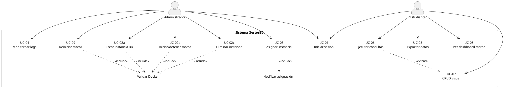

# Gestor de BD - API Backend

API RESTful construida con .NET 9 y ASP.NET Core, diseñada siguiendo los principios de Arquitectura Limpia (Clean Architecture). Proporciona una base sólida y segura para la gestión de usuarios y autenticación utilizando JSON Web Tokens (JWT) con soporte para Refresh Tokens y un sistema de logout seguro.

## Características Principales

-   **Autenticación Segura con JWT**: Implementación completa de Access Tokens y Refresh Tokens.
-   **Logout del Lado del Servidor**: Invalidación de Refresh Tokens para un cierre de sesión seguro.
-   **Autorización Basada en Roles**: Endpoints protegidos que requieren roles específicos (ej. "Admin").
-   **Arquitectura Limpia**: Separación estricta de responsabilidades entre las capas de Dominio, Aplicación, Infraestructura y API.
-   **Domain-Driven Design (DDD)**: Uso de Value Objects (`Email`, `Password`, `PersonName`) para encapsular la lógica de negocio y asegurar la validez de los datos en el núcleo del dominio.
-   **Hashing de Contraseñas y Refresh Tokens**: Uso de `BCrypt.Net` para almacenar credenciales y tokens de forma segura.
-   **Manejo de Resultados Explícito**: Implementación de objetos `Result` para un manejo de errores y éxitos claro y tipado.
-   **Respuestas de Error Estandarizadas**: Uso de `ProblemDetails` para devolver errores consistentes según las guías de Microsoft.
-   **Entity Framework Core 9**: Interacción con la base de datos MySQL a través del proveedor Pomelo.
-   **Documentación de API con Swagger**: Interfaz de usuario interactiva para probar los endpoints de la API, configurada para manejar la autenticación JWT.

## Arquitectura del Proyecto

El proyecto sigue una estricta estructura de Arquitectura Limpia, donde las dependencias fluyen hacia el centro (Dominio).

```
Api/ → Application/ → Domain ←
Infrastructure/ → Application/ → Domain ←
```

-   **`Domain`**: Contiene las entidades puras del negocio (`User`, `Role`) y los Value Objects. Es el núcleo y no depende de ninguna otra capa.
-   **`Application`**: Contiene la lógica de la aplicación, definiendo los "casos de uso" a través de interfaces (`IAuthService`, `IJwtService`) y los DTOs que sirven como contratos de datos.
-   **`Infrastructure`**: Implementa las interfaces de la capa de Aplicación. Contiene la lógica de acceso a la base de datos (`AppDbContext`), la implementación de servicios externos (`JwtService`, `AuthService`) y otras preocupaciones técnicas.
-   **`Api`**: Es el punto de entrada de la aplicación. Contiene los Controladores, la configuración del middleware y el arranque de la aplicación (`Program.cs`).

## Cómo Empezar

Sigue estos pasos para levantar el entorno de desarrollo local.

### Prerrequisitos

-   [.NET 9 SDK](https://dotnet.microsoft.com/download/dotnet/9.0)
-   Una instancia de base de datos MySQL en ejecución.

### 1. Configuración

-   Clona este repositorio.
-   Abre el archivo `nexusDB.Api/appsettings.Development.json`.
-   Modifica la cadena de conexión `DefaultConnection` para que apunte a tu base de datos MySQL.

    ```json
    "ConnectionStrings": {
      "DefaultConnection": "Server=localhost;Database=nexusDB;Port=3306;User=root;Password=tu_contraseña;"
    }
    ```
    Asegúrate de que el usuario de la base de datos tenga permisos para crear y eliminar bases de datos.

### 2. Configuración de la Base de Datos

Usa Entity Framework Core para crear y sembrar la base de datos y las tablas a partir de las entidades del proyecto.

Abre una terminal en la raíz del proyecto (`C:/Users/Msuthy/Desktop/gestorBD_Backend/`) y ejecuta los siguientes comandos:

1.  **Eliminar la base de datos existente (si hay alguna):**
    ```sh
    dotnet ef database drop --project nexusDB.Infrastructure --startup-project nexusDB.Api
    ```
    Confirma con `y` cuando se te solicite.

2.  **Eliminar la carpeta de migraciones (si existe):**
    Para asegurar un estado limpio, elimina la carpeta `Migrations` dentro del proyecto `nexusDB.Infrastructure`.

3.  **Crear una nueva migración inicial:**
    ```sh
    dotnet ef migrations add InitialCreate --project nexusDB.Infrastructure --startup-project nexusDB.Api
    ```
    Este comando creará una migración que incluye la creación de tablas y el seeding de los roles "User" y "Admin".

4.  **Aplicar la migración a la base de datos:**
    ```sh
    dotnet ef database update --project nexusDB.Infrastructure --startup-project nexusDB.Api
    ```
    Esto creará la base de datos y las tablas, e insertará los roles iniciales.

### 3. Ejecutar la Aplicación

```sh
dotnet run --project nexusDB.Api
```

La API estará disponible en `https://localhost:XXXX` (la URL se mostrará en la consola). La documentación de Swagger estará disponible en `https://localhost:XXXX/swagger`.

## Endpoints de la API de Autenticación

(Esta sección no requiere cambios, ya que la funcionalidad de los endpoints es la misma)

... (El resto del README.md se mantiene igual)
1.  **Registra un usuario** usando el endpoint `POST /register`.
2.  **Inicia sesión** con ese usuario usando `POST /login`. Copia el `accessToken` y el `refreshToken` de la respuesta.
3.  **Autoriza Swagger**: Haz clic en el botón `Authorize` en la parte superior derecha. En el diálogo, escribe `Bearer TU_ACCESS_TOKEN` (reemplazando `TU_ACCESS_TOKEN` con el token que copiaste) y haz clic en `Authorize`.
4.  **Accede al perfil**: Ejecuta `GET /profile`. Deberías recibir una respuesta `200 OK`.
5.  **Prueba el rol**: Ejecuta `GET /admin-data`. Deberías recibir una respuesta `403 Forbidden`, ya que el usuario por defecto tiene el rol "User".
6.  **Refresca la sesión**: Usa el `refreshToken` en el endpoint `POST /refresh`. Recibirás un nuevo par de tokens.
7.  **Cierra sesión**: Asegurándote de que sigues autorizado con un token válido, ejecuta `POST /logout`. Recibirás una respuesta `204 No Content`.
8.  **Verifica el logout**: Intenta usar el `refreshToken` original de nuevo en `POST /refresh`. Deberías recibir una respuesta `401 Unauthorized`, confirmando que el token fue invalidado.


# Librerias Docker usadas (temporal, borrar al terminar)
El proyecto "nexusDB.Api" tiene las referencias de paquete siguientes
[net9.0]:
Paquete de nivel superior                            Solicitado           Resuelto
> Microsoft.AspNetCore.Authentication.JwtBearer      9.0.0-rc.2.24470.3   9.0.0-rc.2.24474.3
> Microsoft.AspNetCore.OpenApi                       9.0.11               9.0.11            
> Swashbuckle.AspNetCore.Filters                     9.0.0-beta.2         9.0.0             
> Swashbuckle.AspNetCore.SwaggerUI                   9.0.6                9.0.6

El proyecto "nexusDB.Application" tiene las referencias de paquete siguientes
[net9.0]: No se encontró ningún paquete para este marco.
El proyecto "nexusDB.Domain" tiene las referencias de paquete siguientes
[net9.0]: No se encontró ningún paquete para este marco.
El proyecto "nexusDB.Infrastructure" tiene las referencias de paquete siguientes                                                                                  
[net9.0]:
Paquete de nivel superior                   Solicitado   Resuelto
> BCrypt.Net-Next                           4.0.3        4.0.3   
> Docker.DotNet                             3.125.15     3.125.15
> Microsoft.EntityFrameworkCore             9.0.0        9.0.0   
> Microsoft.EntityFrameworkCore.Design      9.0.0        9.0.0   
> Pomelo.EntityFrameworkCore.MySql          9.0.0        9.0.0   
> System.IdentityModel.Tokens.Jwt           8.14.0       8.14.0  

### diagrama codigo casos de uso (codigo para visualizar en PlantUML)



| UC-ID  | Nombre (en el diagrama) | Actor      | ¿Qué hace?           | Criterio rápido         |
| ------ | ----------------------- | ---------- | -------------------- | ----------------------- |
| UC-01  | Iniciar sesión          | Ambos      | Login JWT            | Token ≤ 15 min          |
| UC-02a | Crear instancia BD      | Admin      | Crea motor           | Puerto 7000-7999 único  |
| UC-02b | Iniciar/detener motor   | Admin      | Start/stop           | Docker running ≤ 30 s   |
| UC-02c | Eliminar instancia      | Admin      | Borra contenedor     | Sin errores, log audit  |
| UC-03  | Asignar instancia       | Admin      | Entrega BD a alumno  | Solo sus instancias     |
| UC-04  | Monitorear logs         | Admin      | Ver logs/métricas    | Delay < 5 s             |
| UC-09  | Reiniciar motor         | Admin      | Recupera falla       | Reinicio < 30 s         |
| UC-05  | Ver dashboard motor     | Estudiante | Ve datos de conexión | Carga ≤ 3 s             |
| UC-06  | Ejecutar consultas      | Estudiante | Query SQL/NoSQL      | Resultados < 30 s       |
| UC-07  | CRUD visual             | Estudiante | Edición gráfica      | Extend opcional         |
| UC-08  | Exportar datos          | Estudiante | Descarga CSV/JSON    | Archivo ≤ 50 MB, < 10 s |
